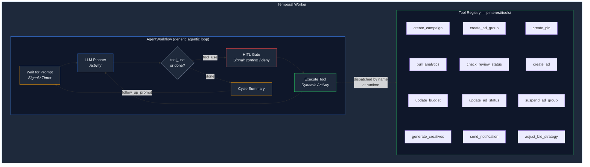
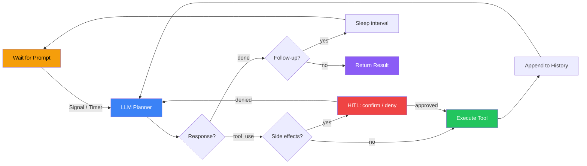

# Pinterest Ad Agent — Temporal Agentic Framework

Autonomous Pinterest ad campaign agent built on a **generic agentic framework** powered by [Temporal](https://temporal.io/) (durable execution) and [Claude](https://anthropic.com/) (LLM decision-making).

The architecture separates the **generic agentic loop** from **domain-specific tools**, following [Temporal's recommended patterns](https://docs.temporal.io/ai-cookbook/agentic-loop-tool-call-claude-python) for building production AI agents.

## Architecture



### Key Design Decisions

| Pattern | Implementation |
|---------|---------------|
| **Generic Workflow** | `agent/workflow.py` — agentic loop with no domain knowledge |
| **Dynamic Activities** | `@activity.defn(dynamic=True)` dispatches tools by name at runtime |
| **Native Tool Calling** | Uses Claude's `tools` API parameter for reliable tool dispatch |
| **Tool Registry** | `pinterest/tools/__init__.py` — add/remove tools without touching the workflow |
| **HITL via Signals** | `confirm()` / `deny()` signals for human-in-the-loop gates |
| **ContinueAsNew** | Prevents event history growth for long-running campaigns |
| **Follow-up Loop** | Auto-sends optimization prompts on a configurable schedule |
| **Temporal Retries** | All retry logic handled by Temporal, not the LLM client (`max_retries=0`) |

## Project Structure

```
├── agent/                          # Generic agentic framework (reusable, domain-agnostic)
│   ├── __init__.py
│   ├── models.py                   # ToolDefinition, AgentConfig, LLMResponse, etc.
│   ├── workflow.py                 # AgentWorkflow — the generic agentic loop
│   └── activities.py               # LLM planner activity + dynamic tool dispatcher
│
├── pinterest/                      # Pinterest domain (all domain-specific code)
│   ├── __init__.py
│   ├── config.py                   # Agent configuration (goal, system prompt, tool wiring)
│   ├── shared.py                   # Data models, API constants, currency helpers
│   ├── simulator.py                # Simulated analytics engine (5 decision-forcing cycles)
│   └── tools/                      # Tool definitions + handlers
│       ├── __init__.py             # Tool registry: get_handler(), get_tools()
│       ├── campaign_management.py  # create_campaign, create_ad_group, create_pin, create_ad
│       ├── analytics.py            # pull_analytics, check_review_status
│       ├── optimization.py         # update_budget, update_ad_status, suspend_ad_group, ...
│       ├── creative_generation.py  # generate_creatives (Claude-powered)
│       └── notifications.py        # send_notification
│
├── worker.py                       # Temporal worker registration
├── starter.py                      # Launch a Pinterest campaign workflow
├── run_demo.py                     # Interactive demo — follows workflow in real-time with HITL
├── pyproject.toml
└── .env.example
```

## Prerequisites

- **Python 3.10+**
- **Temporal Cloud** namespace with API key authentication
- **Anthropic API Key** — for Claude LLM calls

### Install Dependencies

```bash
python3 -m venv .venv
source .venv/bin/activate
pip install -e .
```

### Configure Environment

```bash
cp .env.example .env
# Edit .env with your Temporal Cloud and Anthropic settings:
#   TEMPORAL_ADDRESS=your-namespace.tmprl.cloud:7233
#   TEMPORAL_NAMESPACE=your-namespace
#   TEMPORAL_API_KEY=your-temporal-api-key
#   ANTHROPIC_API_KEY=sk-ant-...
#   DEMO_MODE=true
```

## Quick Start

### 1. Start the Worker

```bash
python3 worker.py
```

### 2. Launch a Campaign

```bash
# Default campaign
python3 starter.py

# Custom campaign
python3 starter.py --campaign "Summer Sale 2026" --budget 100 --max-budget 500

# Demo mode (15s evaluation cycles)
DEMO_MODE=true python3 starter.py
```

### 3. Follow the Agent in Real-Time

```bash
# Follow the default workflow (synchronous — shows tool calls, results, and HITL prompts)
python3 run_demo.py

# Follow a specific workflow
python3 run_demo.py -w pinterest-agent-summer-sale-2026

# Faster polling (default is 3s)
python3 run_demo.py --poll 1
```

The demo script automatically:
- Displays each tool call with context (args summary) as it happens
- Shows tool results with formatted output
- Prompts for HITL approval inline when the agent is waiting for confirmation
- Displays cycle summaries as they complete
- Exits when the workflow completes or max cycles reached

## How It Works

### The Agentic Loop



### Campaign Lifecycle

1. **Setup** — Agent generates creatives, creates campaign/ad group/pins/ads
2. **Sleep** — Waits for evaluation interval (15s demo / 6h production)
3. **Optimize** — Pulls analytics, checks review statuses, decides actions
4. **Repeat** — Cycles until budget exhausted or campaign ends

### Demo Mode

Set `DEMO_MODE=true` in `.env` for 15-second evaluation intervals instead of 6 hours.

## Adding New Tools

Adding a tool requires **zero changes** to the workflow or worker. Just:

### 1. Create the Tool File

```python
# pinterest/tools/my_new_tool.py
from agent.models import ToolArgument, ToolDefinition

my_tool_definition = ToolDefinition(
    name="my_tool",
    description="What this tool does (shown to the LLM)",
    arguments=[
        ToolArgument(name="param1", type="string", description="..."),
        ToolArgument(name="param2", type="number", description="...", required=False),
    ],
    timeout_seconds=60,
)

async def my_tool_handler(param1: str, param2: float = 0.0) -> dict:
    """The actual implementation."""
    return {"result": "success"}
```

### 2. Register in `pinterest/tools/__init__.py`

```python
from .my_new_tool import my_tool_definition, my_tool_handler

_TOOL_DEFINITIONS["my_tool"] = my_tool_definition
_TOOL_HANDLERS["my_tool"] = my_tool_handler
```

That's it. The LLM will see the new tool in its next planning call.

## Building a Different Agent

The framework is generic. To build a non-Pinterest agent, create a new domain directory (e.g., `shopping/`) with its own tools and config:

```python
# shopping/config.py
from agent.models import AgentConfig, AgentContinueState
from shopping.tools import get_tools

config = AgentConfig(
    goal="Your agent's goal",
    tools=get_tools(),
    system_prompt="Domain-specific instructions for the LLM",
    initial_prompt="What to do first",
    follow_up_prompt="Recurring task (optional)",
    follow_up_interval_seconds=3600,
)

state = AgentContinueState(config=config)
# Pass `state` to AgentWorkflow.run()
```

## Nexus Readiness

The codebase is annotated with `TODO [Nexus-readiness]` comments showing where Nexus Operations would be introduced:

- Each tool could become a **Nexus Operation** behind a **Nexus Service**
- The workflow would call `workflow.execute_nexus_operation()` for cross-namespace tools
- Other teams could contribute tools by deploying their own Nexus Services
- Tools would be registered at a shared **Nexus Endpoint**

## Signals & Queries

| Type | Name | Description |
|------|------|-------------|
| Signal | `user_prompt(str)` | Send a new message to the agent |
| Signal | `confirm()` | Approve a pending HITL tool execution |
| Signal | `deny()` | Reject a pending HITL tool execution |
| Query | `get_status()` | Current state, iterations, active tool, cycle count |
| Query | `get_conversation_history()` | Full conversation history |
| Query | `get_cycle_summaries()` | Summary of each optimization cycle's decisions |

## Environment Variables

| Variable | Required | Description |
|----------|----------|-------------|
| `TEMPORAL_ADDRESS` | Yes | `your-namespace.tmprl.cloud:7233` |
| `TEMPORAL_NAMESPACE` | Yes | Your Temporal Cloud namespace |
| `TEMPORAL_API_KEY` | Yes | Temporal Cloud API key |
| `ANTHROPIC_API_KEY` | Yes | Claude API key |
| `DEMO_MODE` | No | `true` for 15-second evaluation intervals |
