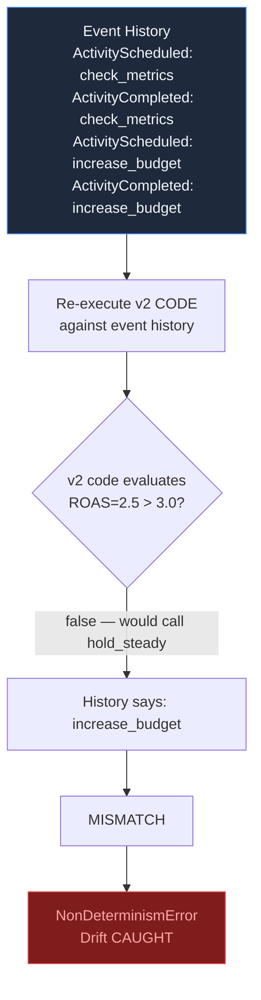
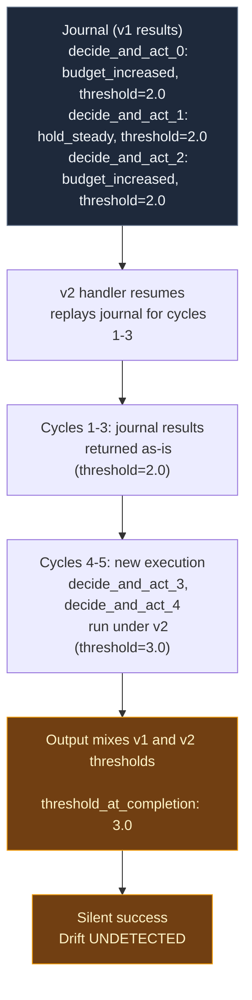

# Temporal vs Restate: Replay Model Comparison

A focused demo comparing how Temporal and Restate handle **code changes to in-flight executions**.

Temporal's strict deterministic replay catches divergence immediately. Restate's journal-based replay silently continues with mixed-version logic.

## The Scenario

A campaign budget optimizer runs 5 cycles. Each cycle checks ROAS and decides whether to increase the budget.

- **v1 logic**: increase budget when `ROAS > 2.0`
- **v2 logic**: increase budget when `ROAS > 3.0` (threshold raised)

The critical moment: **Cycle 1 has `ROAS = 2.5`**.
- Under v1: `2.5 > 2.0` is true, `increase_budget` is called
- Under v2: `2.5 > 3.0` is false, `hold_steady` is called

The workflow starts under v1, completes cycle 1 (budget increased), then the service restarts with v2 code.

## What Happens

| | Temporal | Restate |
|---|---|---|
| **Replay mechanism** | Re-executes workflow code against event history | Returns stored results from journal |
| **Divergence detected** | Yes -- `NonDeterminismError` at the exact point | No -- silently continues |
| **Result** | Workflow halted, operator alerted | Completes with mixed v1/v2 decisions |
| **Audit trail** | Event history shows exact code path taken | Journal shows results but not decision logic |
| **Financial impact** | Prevented -- stopped before further damage | Budget increased under stale rules, undetected |

## Prerequisites

- Python 3.10+
- Temporal CLI (`brew install temporal`)
- Docker (for Restate server)

## Setup

```bash
python3 -m venv .venv
source .venv/bin/activate
pip install -e .
```

## Run the Demos

### Temporal (strict replay -- catches divergence)

```bash
cd replay-demo/temporal
bash break_it.sh
```

Expected: `NonDeterminismError` after the v2 worker replays cycle 1.

### Restate (loose replay -- silent drift)

```bash
cd replay-demo/restate
bash break_it.sh
```

Expected: Workflow completes "successfully" with mixed v1/v2 decisions. Check `log/handler.log` for the full event trail showing `[v1]` and `[v2]` entries side by side.

## Event-by-Event Comparison

| # | Event | Temporal | Restate |
|---|-------|----------|---------|
| 1 | **Start** | Workflow started on v1 worker (threshold=2.0) | Handler invoked on v1 deployment (threshold=2.0) |
| 2 | **Cycles 1-3** (v1) | Activities execute normally. Cycle 1: `increase_budget` (ROAS=2.5 > 2.0). Cycle 2: `hold_steady` (1.8 <= 2.0). Cycle 3: `increase_budget` (3.2 > 2.0). | `ctx.run` calls execute and journal under v1. Journal records `threshold_used: 2.0` for all three cycles. |
| 3 | **Kill during sleep** | v1 worker terminated during cycle 3 sleep | v1 handler terminated during cycle 3 sleep |
| 4 | **Deploy v2** | v2 worker starts (threshold=3.0) | v2 handler starts (threshold=3.0) |
| 5 | **Replay begins** | Re-executes v2 workflow code against event history | v2 handler resumes invocation from journal |
| 6 | **Replay: cycle 1** | v2 code: `2.5 > 3.0` is false, would schedule `hold_steady`. History says `increase_budget` was scheduled. | Journal returns stored result: `{action: "budget_increased", threshold_used: 2.0}`. v2 handler logs show `threshold=3.0` in memory but journal result used. |
| 7 | **DIVERGENCE** | **`NonDeterminismError`**: `increase_budget` does not match `hold_steady`. Workflow halted. | No error. Restate replays journal results for cycles 1-3 without checking v2 code path consistency. |
| 8 | **Cycle 4** (v2) | Halted | First new cycle under v2: ROAS=2.7 <= 3.0, held steady (threshold=3.0) |
| 9 | **Cycle 5** (v2) | Halted | v2: ROAS=0.9 <= 3.0, held steady (threshold=3.0) |
| 10 | **Final state** | **FAILED** -- operator alerted, workflow preserved at divergence | **"SUCCEEDED"** -- mixed v1/v2 thresholds in output, `threshold_at_completion: 3.0` |

Row 7 is the critical moment. Temporal compares the activity the code wants to schedule against what was recorded in the event history -- a mismatch halts execution immediately.

Restate replays journal results for completed `ctx.run` calls without re-evaluating the code path. Cycles 1-3 return v1 results (threshold=2.0), cycles 4-5 execute under v2 (threshold=3.0). The execution completes with **mixed thresholds in the same invocation** and no error. Verified via `sys_journal` query and application output.

## Demo Output

**Temporal:**
```
NonDeterminismError: Activity type of scheduled event
'increase_budget' does not match activity type of
activity command 'hold_steady'
```

**Restate** (application output -- mixed thresholds, no error):
```
cycle 1: ROAS=2.5 > 2.0  -> INCREASED (threshold=2.0)     <- v1 journal
cycle 2: ROAS=1.8 <= 2.0 -> held steady (threshold=2.0)    <- v1 journal
cycle 3: ROAS=3.2 > 2.0  -> INCREASED (threshold=2.0)      <- v1 journal
cycle 4: ROAS=2.7 <= 3.0 -> held steady (threshold=3.0)    <- v2 new
cycle 5: ROAS=0.9 <= 3.0 -> held steady (threshold=3.0)    <- v2 new
threshold_at_completion: 3.0
Status: Completed successfully. No error.
```

**Restate journal** (queried via `sys_journal` -- matches application output):
```
decide_and_act_0: {action: "budget_increased", threshold_used: 2.0}  <- v1
decide_and_act_1: {action: "hold_steady",      threshold_used: 2.0}  <- v1
decide_and_act_2: {action: "budget_increased", threshold_used: 2.0}  <- v1
decide_and_act_3: {action: "hold_steady",      threshold_used: 3.0}  <- v2
decide_and_act_4: {action: "hold_steady",      threshold_used: 3.0}  <- v2
```

Cycles 1-3 used threshold=2.0 (v1), cycles 4-5 used threshold=3.0 (v2). Mixed decision logic within a single invocation. No error, no warning. The `threshold_at_completion: 3.0` suggests the handler ran entirely under v2, but the decisions tell a different story.

## Temporal's Safe Migration Path

Temporal provides first-class tools for evolving workflow logic safely:

**`workflow.patched()` -- Inline version gates:**
```python
if roas > (3.0 if workflow.patched("roas-threshold-v2") else 2.0):
    await workflow.execute_activity(increase_budget, ...)
```

Existing workflows continue under v1 rules. New workflows use v2. No drift.

**Worker Versioning -- Deploy-level isolation:**
Route in-flight workflows to v1 workers, new workflows to v2 workers. Zero code changes.

Temporal forces you to explicitly handle version transitions. This feels like friction during development, but it prevents silent financial errors in production. When managing thousands of campaigns with real ad spend, catching a mistake beats silently continuing.

## Architecture

### Temporal: Replay via Code Re-execution



### Restate: Replay via Journal Results



## Project Structure

```
replay-demo/
  temporal/
    workflow_v1.py    # Workflow with threshold=2.0
    workflow_v2.py    # Workflow with threshold=3.0
    activities.py     # check_metrics + increase_budget
    worker.py         # Worker with v1/v2 switching
    starter.py        # Start workflow + query state
    break_it.sh       # Automated demo script
  restate/
    handler.py        # Handler with env-controlled threshold (ROAS_THRESHOLD)
    break_it.sh       # Automated demo script
    log/              # Handler logs (gitignored)
```
